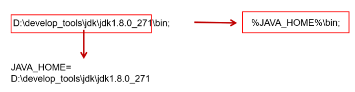
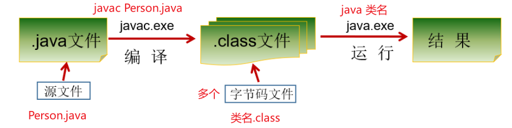
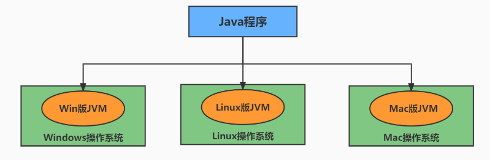

## DOS操作窗口常用命令

| 操作                | 说明                                      |
| ------------------- | ----------------------------------------- |
| d:                  | 表示切换到d盘。                           |
| dir                 | 列出当前目录(directory)下的文件以及文件夹 |
| cd 目录             | 进入指定单级目录(change directory)。      |
| cd 目录1\目录2\\... | 进入指定多级目录。                        |
| cd ..               | 回退到上一级目录。                        |
| cd \ 或 cd /        | 回退到盘符目录。                          |

| 操作          | 说明                                                         |
| ------------- | ------------------------------------------------------------ |
| md 文件目录名 | 创建指定的文件目录(make directory)。                         |
| rd 文件目录名 | 删除指定的文件目录（如文件目录内有数据，删除失败）(remove directory) |

| 操作              | 说明                 |
| ----------------- | -------------------- |
| cls               | 清屏。               |
| exit              | 退出命令提示符窗口。 |
| ←  →              | 移动光标             |
| ↑  ↓              | 调阅历史操作命令     |
| Delete和Backspace | 删除字符             |


## JAVA技术体系平台

JAVA SE：支持面向桌面级应用开发

JaVA EE：定位在服务器端的web应用开发

JAVA ME：支持JAVA程序运行在移动终端应用开发


## JDK和JRE

JDK：JAVA程序开发工具包，包含JRE和开发人员使用的工具。

> JDK = JRE + 开发工具集（例如Javac编译工具等）

JRE：JAVA程序运行时环境，包含JVM和运行时所需要的核心类库。

> JRE = JVM + JavaSE标准类库


## Path环境变量

Path环境变量是window执行命令时，所要搜寻的路径。那么我们希望jdk\bin路径下的命令可以在任何文件路径下执行。



## Java程序运行



> Java中区分大小写，windows系统不区分大小写，解释运行时要注意区分大小写。

一个源文件中可以声明多个类，但是最多只能有一个类使用public进行声明，且要求声明为public的类的类名与源文件名相同。


## 文档注释

文档注释内容可以被JDK提供的javadoc工具解析，生成网页形式的说明文档

```bash
javadoc -d mydir -author -version CommentTest.java
```

API：应用程序编程接口

Java API文档：也就是Java提供基础类的说明文档，告诉开发者如何使用这些类。

API文档

- 在线看：https://docs.oracle.com/en/java/javase/17/docs/api/index.html
- 离线下载：https://www.oracle.com/java/technologies/javase-jdk17-doc-downloads.html

## Java语言的特点

- 跨平台性



- 面向对象性
- 健壮性
- 安全性高
- 简单性
- 高性能

缺点

- 语法过于复杂、严谨
- 大型网站开发，整个架构会比较重
- 并非适用于所有领域

## JVM

Java虚拟机，是Java程序的运行环境

- 实现Java程序的跨平台性
- 自动内存管理（内存分配和回收）


## 关键字与标识符

[Java Language keyword](https://docs.oracle.com/javase/tutorial/java/nutsandbolts/_keywords.html)

标识符命名规则

> 由26个英文字母大小写，0-9 ，_或 $ 组成  
> 数字不可以开头。
> 不可以使用关键字和保留字，但能包含关键字和保留字。
> Java中严格区分大小写，长度无限制。
> 标识符不能包含空格。

标识符命名规范

> 包名：多单词组成时所有字母都小写：xxxyyyzzz。
> 例如：java.lang、com.atguigu.bean

> 类名、接口名：多单词组成时，所有单词的首字母大写：XxxYyyZzz
> 例如：HelloWorld，String，System等

> 变量名、方法名：多单词组成时，第一个单词首字母小写，第二个单词开始每个单词首字母大写：xxxYyyZzz
> 例如：age,name,bookName,main,binarySearch,getName

> 常量名：所有字母都大写。多单词时每个单词用下划线连接：XXX_YYY_ZZZ
> 例如：MAX_VALUE,PI,DEFAULT_CAPACITY
